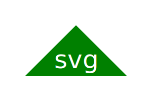

SVG Logo Generator

Creates an svg.logo

Description
This project creates a logo with three letters and three different shapes using node index.js

Getting Started
Dependencies
use node index.js in the terminal to create your logo
Examples/Walkthrough
 

Authors
Cole Chaffin

Version History
1.0.0
License
MIT

Acknowledgments
https://developer.mozilla.org/en-US/docs/Web/SVG
